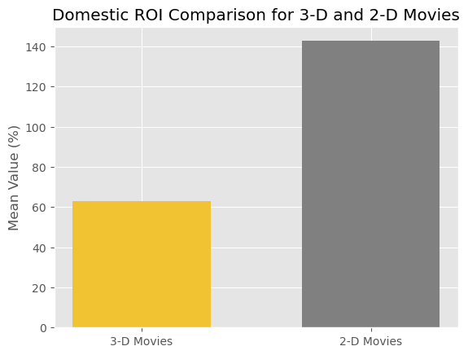

# Movie Industry Data Analysis

## Overview
Our firm is advising a company that plans to venture into the movie industry by setting up a new movie studio. Our clients require that we use available data to explore what films have done well and why. They have tasked us with finding trends and relationships in this data that may guide their decisions. Such exploration may include recommendations on movie type, who to hire, when to make movies, how much to spend, etc., all in order to maximize profits. By the end of our analysis, we will provide five data-backed and statistically tested recommendations for our client's new movie studio.

The data we will use is publicly available through [IMDB](https://www.imdb.com/), [Box Office Mojo](https://www.boxofficemojo.com/), [Rotten Tomatoes](https://www.rottentomatoes.com/), [The Movie Database (TMDB)](https://www.themoviedb.org/), and [The Numbers](https://www.the-numbers.com/).

Our presentation can be found here: [Slide Deck](https://docs.google.com/presentation/d/1RR23O4ka1Zdvgp1HC9cLXy5smHbgusWzRsVdYAl3bDw/edit?usp=sharing) 

## Business Understanding
The two major stakeholders in the movie industry are the studios and the audiences.

The industry is dominated by large, established studios. The "Big Five" include Universal, Paramount, Warner Bros., Disney, and Sony. These companies have the connections, influence, and deep pockets to create most of the well-known blockbusters we see in theaters today. However, their tactic of mass appeal leaves portions of the market open for smaller studios. Audiences are extremely diverse, with many movie-goers preferring lower budget, more niche storytelling. Smaller studios like A24 became extremely successful off of complex, high-quality films made with lesser-known actors. Therefore, there is room in the industry for a new studio to capture mraketshare.

## Data Understanding
The IMDB database contains 150k records, and from it we took information on directors, writers, movie runtime, and release dates.

The Numbers dataset consists of about 6k records, and we use it for its financial information: domestic gross and production budget. While the size of this dataset is a small fraction of the other two, it is also our most extensive source of financial data, which is a crucial metric of success.

Finally, the Movie Database (TMDB) consists of about 27k records. Its most important metric is the popularity rating, which is calculated as a "lifetime" score. It takes into account viewer votes and views, watchlisting, and total number of votes. The breakdown for what is included can be found here: [TMDB Popularity Score](https://developer.themoviedb.org/docs/popularity-and-trending). 

## Data Preparation
Major data cleaning included limiting our analysis to post-2000 movies, because the vast majority of movies fall within this period. In addition, we removed budgetary outliers, because a new studio is unlikely to afford that expense. 

We chose three dependent variables for analysis: the popularity score (linked in the section above), domestic gross, and domestic ROI (a calculated value).

Finally, rather than creating only one shared dataset, we created separate datasets for each of our recommendations. This enabled us to save as much information as possible for each test.

## Analysis and Results/Recommendations
### Analysis: Release Month
Below, we graphically explore the relationship between the month of release of a movie and, first, the average domestic gross revenue, and second, the average domestic ROI.


From these graphs, there are a few main takeaways:

First, the month in which you release a film matters. We can see summer is indeed the time for blockbusters -- May through July has the highest domestic gross numbers, and some of the highest domestic ROI. We can also see a bump in gross revenue at the end of the year. This, presumably, reflects the run-up to the Oscars, when studios release some of the movies that they think are most likely to garner them prestigious awards. Notably, however, **the ROI for those same months is much lower.** This would be explained by the fact that large studios are willing to swallow losses -- that they are willing to put out rather expensive films -- in the chase for prestige and recognition. 

As a newer studio, it makes more sense to avoid this high-risk, end-of-year scramble, and to instead focus on months that seem to be a surer bet. The summer months certainly make sense; people generally have more free time and, perhaps, are looking for an air-conditioned way to spend a few hours. But it also seems that **the springtime** presents an opportunity. There is a slightly higher domestic gross in March, with a similarly higher ROI. This might reflect the fact that spring-breakers have time to spare and are therefore more likely to go to the movies. As a new studio, this could be a good period in which to break into the market.

In `Final.ipynb` we also perform hypothesis testing -- specifically, an ANOVA on the various months of release. The first ANOVA -- regarding gross domestic revenue -- demonstrates that there is, indeed, a statistically significant difference in the gross domestic revenue of movies released in different months; the latter ANOVA -- regarding ROI -- is higher than our chosen $\alpha$, and thus there we cannot reject our null hypothesis. In other words, the second ANOVA shows that there is not a statistically significant difference in average ROI among the different months. Still, we can see there are variations in the means, and can try to draw conclusions accordingly.

### Analysis: 2-D vs. 3-D
We will compare the 3-D movies with 2-D movies based on domestic ROI, domestic gross, and popularity. Looking at ROI and gross will help understand which group may be more profitable, and the popularity metric is also important in order to try to determine which group of movies may help the new studio gain more recognition and media popularity. First, we will create 4 bar charts to compare the means of the 3-D and 2-D movies over these metrics. We include a production budget chart to help explain what we are seeing, as production budget may have an affect domestic gross and popularity.




### Analysis: Experienced vs. Inexperienced Writers & Directors
Experienced directors and writers have higher popularity, domestic gross, and domestic ROI compared to their inexperienced counterparts. In the bar charts below, experienced creators (in yellow) are associated with higher ROI. We would like to test if the means of these two samples are statistically significant, so we perform 2-sample t-tests for our dependent variables of interest (not pictured here is domestic gross, which is included in our Final.ipynb).


As a result of our testing, we found that experienced directors may lead to more popular and higher grossing movies, but does not lead to higher domestic ROI relative to less experienced directors. In a similar vein, hiring experienced writers may lead to more popular movies, but does not lead to higher domestic gross or higher domestic ROI relative to less experienced writers.

Since inexperienced directors and writers are also likely to be more affordable to hire, we recommend choosing a writer based on their salary expectations rather than the number of movies they have led.

### Analysis: Budget
In the scatter plots below, there seems to be a generally positive relationship between production budget and a movie's popularity. We test the strength of this apparent linear relationship using a simple linear regression.


Our regressions show that higher production budget explains very little of the variance in popularity (~15%) and domestic gross (~25%). Therefore, we can recommend that our client spend "reasonably." Obviously, this budgetting decision is subjective, but the ultimate message here is that excessive spending is not necessary to create profit.

### Analysis: Runtime
In the scatter plots below, there seems to be a generally positive relationship between runtime and a movie's popularity and domestic ROI. We test the strength of this apparent linear relationship using a simple linear regression.


Our regression showed that runtime of a movie seems to have no linear relationship with any of our dependent variables of concern. As such, our recommendation to our client is to not focus on the length of the feature. Produce a film which generally falls within the normal length audiences expect, because producing any longer or shorter doesn't improve movie outcomes.

# Conclusions
Our goal has been to provide data-backed recommendations on the best strategy for our client to enter the movie industry. Using three extensive datasets and multiple statistical models, we provide the five recommendations below, each tailored to the resources and interests of a new firm. 

## Summation of Recommendations
**(1.) Time of Release:** 
Spring and summer will be the better times for a newer studio to try to enter the market. Audiences are largest and the most money is available during the summer, but there will be the large summer blockbusters to compete with. Springtime -- and specifically spring break -- presents an opportunity for both high gross revenue and ROI. As a new studio, it probably makes sense to avoid November and December, when big-budget films from major studios are vying for Oscar attention, and would likely crowd out smaller releases. Additionally, later in the year promises much lower ROI than other times -- again, likely because larger studios are willing to swallow losses in the pursuit of prestige.
    
**(2.) 3-D vs. 2-D Movies:** 
We recommend that a new studio avoids 3-D movies. Although we found no significant difference across domestic ROI, domestic gross, and popularity between 3-D movies and 3-D movies, the mean domestic ROI being higher for 2-D movies in our sample may be indicative of higher profitability of 2-D movies when considering the high production budgets of 3-D movies.

**(3.) Experienced Directors and Writers:** 
The experience level of directors and writers does not have a statistically significant effect on domestic ROI. Since experienced directors and writers are more expensive to hire, we recommend that movie studios hire based on salary expectations rather than length of resume. This will keep costs down without sacrificing monetary gain.

**(4.) Budget Recommendation:**
Budget explains about 25% of variance in domestic gross, which is a weak relationship. We recognize that our firm may not have as many funds compared to established movie studios. Therefore, we recommend that our firm maximize production value *within* their capabilities.

**(5.) Runtime Recommendation:** 
Runtime has little to no effect on monetary outcomes or movie popularity. When producing a film, our client should focus on remaining within the average/normal length that a viewer expects.


## Potential Next Steps
Going forward, there are a few other ways that we could use this data to provide additional insights for a new studio. We could simply analyze other variables in the data set, such as genre or actor to provide a recommendation about which genre is most profitable to release and which actors or actresses help gain the most media popularity for a new studio. 

There are also ways that we could have manipulated the variables that we analyzed in our project differently. For example, we could have binned the runtimes of our movies in order to approximate the optimal runtime in terms of profitability and popularity of the movie.

Although not in the scope of this project, building a predictive model would also provide more insights about which types of movies will perform best for a new studio.

## Repo Structure
```
├── data
│   ├── tn.movie_budgets.csv.gz
│   ├── tmdb.movies.csv.gz
│   ├── rt.reviews.tsv.gz
│   ├── imdb.db.zip
│   ├── bom.movie_gross.csv.gz
├── Images
├── Notebooks
│   ├── data_cleaning.ipynb
│   ├── data_cleaning-jay.ipynb
│   ├── scratch_graphs.ipynb
│   ├── __pycache__
│   ├── nate_scratch.ipynb
│   ├── shelley_scratch.ipynb
│   ├── jay_scratch.ipynb
│   ├── Final_Jay_Copy.ipynb
│   ├── Final_copy_shelley.ipynb
├── .gitignore
├── Final.ipynb
├── LICENSE
├── README.md
```
